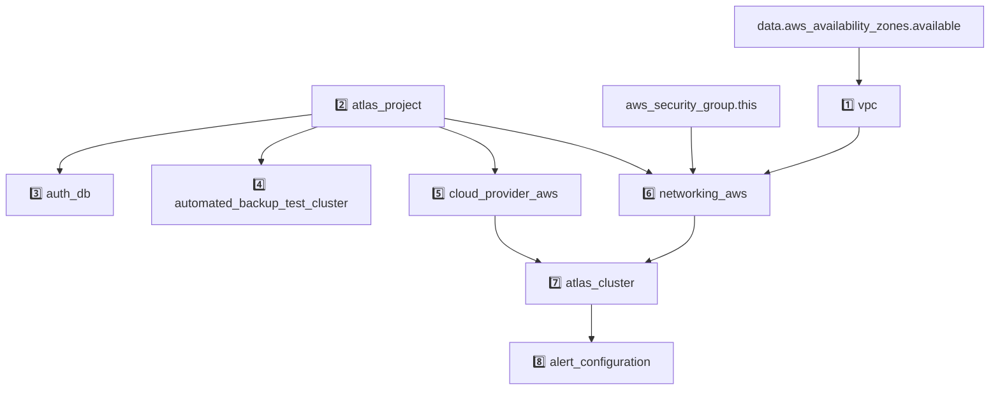

# AWS Full Example

<!-- BEGIN_DISCLAIMER -->
## Disclaimer
This Module is not meant for external consumption.
It is part of a development PoC.
Any usage problems will not be supported.
However, if you have any ideas or feedback, feel free to open a Github Issue!

<!-- END_DISCLAIMER -->

<!-- BEGIN_MODULES -->
## Modules

### Modules Instances
```sh
Module Instances
├── 1️⃣  vpc
│   └── registry.terraform.io/terraform-aws-modules/vpc/aws
├── 2️⃣  atlas_project
│   └── ../../../modules/02_project
├── 3️⃣  auth_db
│   └── ../../../modules/05_auth_db
├── 4️⃣  automated_backup_test_cluster
│   └── ../../../modules/01_cluster
├── 5️⃣  cloud_provider_aws
│   └── ../../../modules/04_cloud_provider_aws
├── 6️⃣  networking_aws
│   └── ../../../modules/06_networking_aws
├── 7️⃣  atlas_cluster
│   └── ../../../modules/01_cluster
└── 8️⃣  alert_configuration
    └── ../../../modules/03_alert_configuration
```
### Module Definitions

```sh
vpc (1️⃣)
└── details skipped
02_project (2️⃣)
└── mongodbatlas_project.this
    └── mongodbatlas_auditing.this
05_auth_db (3️⃣)
├── mongodbatlas_custom_db_role.this
└── mongodbatlas_database_user.aws_iam_roles
01_cluster (7️⃣, 4️⃣)
└── mongodbatlas_advanced_cluster.this
    └── mongodbatlas_cloud_backup_schedule.this
04_cloud_provider_aws (5️⃣)
├── data.aws_caller_identity.current
│   └── aws_kms_key.this
│       └── mongodbatlas_encryption_at_rest.this
├── mongodbatlas_cloud_provider_access_setup.this
│   └── aws_iam_role.this
│       ├── aws_kms_key.this
│       │   └── mongodbatlas_encryption_at_rest.this
│       └── mongodbatlas_cloud_provider_access_authorization.this
│           └── mongodbatlas_encryption_at_rest.this
├── data.aws_iam_role.this
└── mongodbatlas_encryption_at_rest_private_endpoint.this
06_networking_aws (6️⃣)
├── data.aws_vpc.this
│   └── mongodbatlas_project_ip_access_list.access_list_private_endpoints
└── mongodbatlas_privatelink_endpoint.mongodb_endpoint
    └── aws_vpc_endpoint.aws_endpoint
        └── mongodbatlas_privatelink_endpoint_service.private_endpoint
03_alert_configuration (8️⃣)
└── mongodbatlas_alert_configuration.this
```

### Graph with Dependencies
Any resource without a number prefix is defined at the root level.


<!-- END_MODULES -->

<!-- BEGIN_TF_DOCS -->
## Requirements

| Name | Version |
|------|---------|
| <a name="requirement_terraform"></a> [terraform](#requirement\_terraform) | >= 1.8 |
| <a name="requirement_aws"></a> [aws](#requirement\_aws) | ~> 5.0 |
| <a name="requirement_mongodbatlas"></a> [mongodbatlas](#requirement\_mongodbatlas) | ~> 1.26 |

## Providers

| Name | Version |
|------|---------|
| <a name="provider_aws"></a> [aws](#provider\_aws) | 5.100.0 |

## Resources

| Name | Type |
|------|------|
| [aws_security_group.this](https://registry.terraform.io/providers/hashicorp/aws/latest/docs/resources/security_group) | resource |
| [aws_availability_zones.available](https://registry.terraform.io/providers/hashicorp/aws/latest/docs/data-sources/availability_zones) | data source |

## Inputs

| Name | Description | Type | Default | Required |
|------|-------------|------|---------|:--------:|
| <a name="input_atlas_org_id"></a> [atlas\_org\_id](#input\_atlas\_org\_id) | Atlas Organization ID | `string` | n/a | yes |
| <a name="input_atlas_project_name"></a> [atlas\_project\_name](#input\_atlas\_project\_name) | Atlas Project Name | `string` | n/a | yes |
| <a name="input_atlas_region"></a> [atlas\_region](#input\_atlas\_region) | Atlas region where resources will be created | `string` | n/a | yes |
| <a name="input_aws_iam_role_arn_ec2"></a> [aws\_iam\_role\_arn\_ec2](#input\_aws\_iam\_role\_arn\_ec2) | n/a | `string` | n/a | yes |
| <a name="input_aws_iam_role_name"></a> [aws\_iam\_role\_name](#input\_aws\_iam\_role\_name) | Created to be used by the atlas cloud provider | `string` | n/a | yes |
| <a name="input_cloud_provider"></a> [cloud\_provider](#input\_cloud\_provider) | AWS or GCP or AZURE | `string` | n/a | yes |
| <a name="input_cluster_instance_size_name"></a> [cluster\_instance\_size\_name](#input\_cluster\_instance\_size\_name) | Cluster instance size name | `string` | n/a | yes |
| <a name="input_environment"></a> [environment](#input\_environment) | The environment to be built | `string` | n/a | yes |
| <a name="input_mongodb_version"></a> [mongodb\_version](#input\_mongodb\_version) | MongoDB Version | `string` | n/a | yes |
| <a name="input_vpc_name"></a> [vpc\_name](#input\_vpc\_name) | AWS VPC config | `string` | n/a | yes |
| <a name="input_vpc_cidr"></a> [vpc\_cidr](#input\_vpc\_cidr) | n/a | `string` | `"10.0.0.0/16"` | no |

## Outputs

No outputs.
<!-- END_TF_DOCS -->
