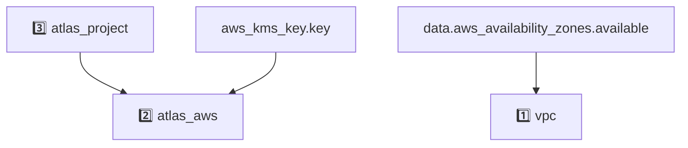

# AWS App Example
<!-- BEGIN_DISCLAIMER -->
## Disclaimer
This Module is not meant for external consumption.
It is part of a development PoC.
Any usage problems will not be supported.
However, if you have any ideas or feedback, feel free to open a Github Issue!

<!-- END_DISCLAIMER -->

<!-- BEGIN_MODULES -->
## Modules

### Modules Instances
```sh
Module Instances
├── 1️⃣  vpc
│   └── registry.terraform.io/terraform-aws-modules/vpc/aws
├── 2️⃣  atlas_aws
│   └── ../../../modules/07_atlas_aws
└── 3️⃣  atlas_project
    └── ../../../modules/02_project
```
### Module Definitions

```sh
vpc (1️⃣)
└── details skipped
07_atlas_aws (2️⃣)
├── module.privatelink_with_existing_vpc_endpoint.mongodbatlas_privatelink_endpoint.mongodb_endpoint
│   ├── module.privatelink_with_existing_vpc_endpoint.aws_vpc_endpoint.aws_endpoint
│   │   ├── module.privatelink_with_existing_vpc_endpoint.data.aws_vpc.this
│   │   │   └── module.privatelink_with_existing_vpc_endpoint.mongodbatlas_project_ip_access_list.access_list_vpc_cidr_block
│   │   └── module.privatelink_with_existing_vpc_endpoint.mongodbatlas_privatelink_endpoint_service.private_endpoint
│   └── module.privatelink_with_existing_vpc_endpoint.data.aws_vpc_endpoint.this
│       ├── module.privatelink_with_existing_vpc_endpoint.data.aws_vpc.this
│       │   └── module.privatelink_with_existing_vpc_endpoint.mongodbatlas_project_ip_access_list.access_list_vpc_cidr_block
│       └── module.privatelink_with_existing_vpc_endpoint.mongodbatlas_privatelink_endpoint_service.private_endpoint
├── module.push_based_log_export.aws_s3_bucket.log_bucket
│   ├── module.push_based_log_export.aws_iam_role_policy.s3_bucket_policy
│   └── module.push_based_log_export.mongodbatlas_push_based_log_export.this
├── mongodbatlas_cloud_provider_access_setup.this
│   └── aws_iam_role.this
│       ├── module.encryption_at_rest.aws_iam_role_policy.encryption_at_rest_policy
│       ├── module.push_based_log_export.aws_iam_role_policy.s3_bucket_policy
│       └── mongodbatlas_cloud_provider_access_authorization.this
│           ├── module.encryption_at_rest.mongodbatlas_encryption_at_rest.this
│           │   └── module.encryption_at_rest.mongodbatlas_encryption_at_rest_private_endpoint.this
│           └── module.push_based_log_export.mongodbatlas_push_based_log_export.this
└── data.aws_iam_role.this
02_project (3️⃣)
└── mongodbatlas_project.this
    └── mongodbatlas_auditing.this
```

### Graph with Dependencies
Any resource without a number prefix is defined at the root level.


<!-- END_MODULES -->

<!-- BEGIN_TF_EXAMPLES -->

<!-- END_TF_EXAMPLES -->

<!-- BEGIN_TF_DOCS -->
## Requirements

| Name | Version |
|------|---------|
| <a name="requirement_terraform"></a> [terraform](#requirement\_terraform) | >= 1.8 |
| <a name="requirement_aws"></a> [aws](#requirement\_aws) | ~> 5.0 |
| <a name="requirement_mongodbatlas"></a> [mongodbatlas](#requirement\_mongodbatlas) | ~> 1.26 |

## Providers

| Name | Version |
|------|---------|
| <a name="provider_aws"></a> [aws](#provider\_aws) | 5.100.0 |

## Resources

| Name | Type |
|------|------|
| [aws_kms_key.key](https://registry.terraform.io/providers/hashicorp/aws/latest/docs/resources/kms_key) | resource |
| [aws_security_group.this](https://registry.terraform.io/providers/hashicorp/aws/latest/docs/resources/security_group) | resource |
| [aws_availability_zones.available](https://registry.terraform.io/providers/hashicorp/aws/latest/docs/data-sources/availability_zones) | data source |
| [aws_caller_identity.current](https://registry.terraform.io/providers/hashicorp/aws/latest/docs/data-sources/caller_identity) | data source |

## Inputs

| Name | Description | Type | Default | Required |
|------|-------------|------|---------|:--------:|
| <a name="input_atlas_org_id"></a> [atlas\_org\_id](#input\_atlas\_org\_id) | Atlas Organization ID | `string` | n/a | yes |
| <a name="input_atlas_project_name"></a> [atlas\_project\_name](#input\_atlas\_project\_name) | Atlas Project Name | `string` | n/a | yes |
| <a name="input_atlas_region"></a> [atlas\_region](#input\_atlas\_region) | Atlas region where resources will be created | `string` | n/a | yes |
| <a name="input_aws_iam_role_arn_ec2"></a> [aws\_iam\_role\_arn\_ec2](#input\_aws\_iam\_role\_arn\_ec2) | n/a | `string` | n/a | yes |
| <a name="input_aws_iam_role_name"></a> [aws\_iam\_role\_name](#input\_aws\_iam\_role\_name) | Created to be used by the atlas cloud provider | `string` | n/a | yes |
| <a name="input_cluster_instance_size_name"></a> [cluster\_instance\_size\_name](#input\_cluster\_instance\_size\_name) | Cluster instance size name | `string` | n/a | yes |
| <a name="input_mongodb_version"></a> [mongodb\_version](#input\_mongodb\_version) | MongoDB Version | `string` | n/a | yes |
| <a name="input_vpc_name"></a> [vpc\_name](#input\_vpc\_name) | AWS VPC config | `string` | n/a | yes |
| <a name="input_tags"></a> [tags](#input\_tags) | Tags to be applied to the resources | `map(string)` | `{}` | no |
| <a name="input_vpc_cidr"></a> [vpc\_cidr](#input\_vpc\_cidr) | n/a | `string` | `"10.0.0.0/16"` | no |

## Outputs

| Name | Description |
|------|-------------|
| <a name="output_atlas_aws"></a> [atlas\_aws](#output\_atlas\_aws) | n/a |
| <a name="output_atlas_project"></a> [atlas\_project](#output\_atlas\_project) | n/a |
<!-- END_TF_DOCS -->
