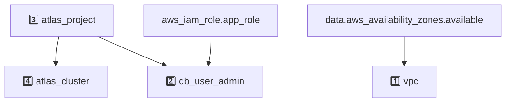

# AWS App Example Dev

<!-- BEGIN_DISCLAIMER -->
## Disclaimer
This Module is not meant for external consumption.
It is part of a development PoC.
Any usage problems will not be supported.
However, if you have any ideas or feedback, feel free to open a Github Issue!

<!-- END_DISCLAIMER -->

<!-- BEGIN_MODULES -->
## Modules

### Modules Instances
```sh
Module Instances
├── 1️⃣  vpc
│   └── registry.terraform.io/terraform-aws-modules/vpc/aws
├── 2️⃣  db_user_admin
│   └── ../../../../modules/07_atlas_aws/modules/database_user_iam_role
├── 3️⃣  atlas_project
│   └── ../../../../modules/02_project
├── 4️⃣  atlas_cluster
│   └── ../../../../modules/08_cluster_poc
└── 5️⃣  cluster
    └── ../../../../modules/08_cluster_poc
```
### Module Definitions

```sh
vpc (1️⃣)
└── details skipped
database_user_iam_role (2️⃣)
└── mongodbatlas_cloud_backup_schedule.this
02_project (3️⃣)
└── mongodbatlas_project.this
    ├── module.ip_access_entry.mongodbatlas_project_ip_access_list.this
    └── mongodbatlas_auditing.this
08_cluster_poc (4️⃣, 5️⃣)
└── data.mongodbatlas_advanced_clusters.this
    └── mongodbatlas_advanced_cluster.this
        ├── module.cloud_backup_schedule.mongodbatlas_cloud_backup_schedule.this
        └── module.search_deployment.mongodbatlas_search_deployment.this
```

### Graph with Dependencies
Any resource without a number prefix is defined at the root level.


<!-- END_MODULES -->

<!-- BEGIN_TF_EXAMPLES -->

<!-- END_TF_EXAMPLES -->

<!-- BEGIN_TF_DOCS -->
## Requirements

The following requirements are needed by this module:

- <a name="requirement_terraform"></a> [terraform](#requirement\_terraform) (>= 1.8)

- <a name="requirement_aws"></a> [aws](#requirement\_aws) (~> 5.0)

- <a name="requirement_mongodbatlas"></a> [mongodbatlas](#requirement\_mongodbatlas) (~> 1.26)

## Providers

The following providers are used by this module:

- <a name="provider_aws"></a> [aws](#provider\_aws) (5.100.0)

## Modules

The following Modules are called:

### <a name="module_atlas_cluster"></a> [atlas\_cluster](#module\_atlas\_cluster)

Source: ../../../../modules/08_cluster_poc

Version:

### <a name="module_atlas_project"></a> [atlas\_project](#module\_atlas\_project)

Source: ../../../../modules/02_project

Version:

### <a name="module_db_user_admin"></a> [db\_user\_admin](#module\_db\_user\_admin)

Source: ../../../../modules/07_atlas_aws/modules/database_user_iam_role

Version:

### <a name="module_vpc"></a> [vpc](#module\_vpc)

Source: terraform-aws-modules/vpc/aws

Version: 5.1.0

## Resources

The following resources are used by this module:

- [aws_iam_role.app_role](https://registry.terraform.io/providers/hashicorp/aws/latest/docs/resources/iam_role) (resource)
- [aws_security_group.this](https://registry.terraform.io/providers/hashicorp/aws/latest/docs/resources/security_group) (resource)
- [aws_availability_zones.available](https://registry.terraform.io/providers/hashicorp/aws/latest/docs/data-sources/availability_zones) (data source)
- [aws_caller_identity.current](https://registry.terraform.io/providers/hashicorp/aws/latest/docs/data-sources/caller_identity) (data source)

## Required Inputs

The following input variables are required:

### <a name="input_atlas_org_id"></a> [atlas\_org\_id](#input\_atlas\_org\_id)

Description: Atlas Organization ID

Type: `string`

### <a name="input_atlas_project_name"></a> [atlas\_project\_name](#input\_atlas\_project\_name)

Description: Atlas Project Name

Type: `string`

### <a name="input_atlas_region"></a> [atlas\_region](#input\_atlas\_region)

Description: Atlas region where resources will be created

Type: `string`

### <a name="input_aws_iam_role_app_name"></a> [aws\_iam\_role\_app\_name](#input\_aws\_iam\_role\_app\_name)

Description: n/a

Type: `string`

### <a name="input_cluster_name"></a> [cluster\_name](#input\_cluster\_name)

Description: Cluster name

Type: `string`

### <a name="input_vpc_name"></a> [vpc\_name](#input\_vpc\_name)

Description: AWS VPC config

Type: `string`

## Optional Inputs

The following input variables are optional (have default values):

### <a name="input_dev_ips"></a> [dev\_ips](#input\_dev\_ips)

Description: n/a

Type:

```hcl
map(object({
    comment    = string
    ip_address = string
  }))
```

Default: `{}`

### <a name="input_tags"></a> [tags](#input\_tags)

Description: Tags to be applied to the resources

Type: `map(string)`

Default: `{}`

### <a name="input_vpc_cidr"></a> [vpc\_cidr](#input\_vpc\_cidr)

Description: n/a

Type: `string`

Default: `"10.0.0.0/16"`

## Outputs

The following outputs are exported:

### <a name="output_atlas_cluster"></a> [atlas\_cluster](#output\_atlas\_cluster)

Description: n/a

### <a name="output_atlas_project"></a> [atlas\_project](#output\_atlas\_project)

Description: n/a

### <a name="output_db_user_admin"></a> [db\_user\_admin](#output\_db\_user\_admin)

Description: n/a
<!-- END_TF_DOCS -->
