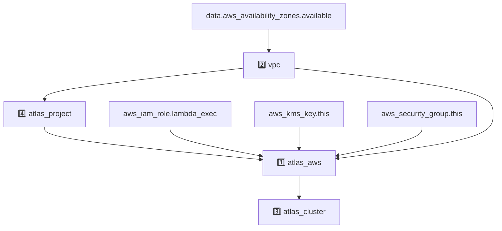

# AWS App Example
<!-- BEGIN_DISCLAIMER -->
## Disclaimer
This Module is not meant for external consumption.
It is part of a development PoC.
Any usage problems will not be supported.
However, if you have any ideas or feedback, feel free to open a Github Issue!

<!-- END_DISCLAIMER -->

<!-- BEGIN_MODULES -->
## Modules

### Modules Instances
```sh
Module Instances
├── 1️⃣  atlas_aws
│   └── ../../../../modules/07_atlas_aws
├── 2️⃣  vpc
│   └── registry.terraform.io/terraform-aws-modules/vpc/aws
├── 3️⃣  atlas_cluster
│   └── ../../../../modules/08_cluster_poc
└── 4️⃣  atlas_project
    └── ../../../../modules/02_project
```
### Module Definitions

```sh
07_atlas_aws (1️⃣)
├── module.privatelink_with_existing_vpc_endpoint.mongodbatlas_privatelink_endpoint.mongodb_endpoint
│   ├── module.privatelink_with_existing_vpc_endpoint.aws_vpc_endpoint.aws_endpoint
│   │   ├── module.privatelink_with_existing_vpc_endpoint.data.aws_vpc.this
│   │   │   └── module.privatelink_with_existing_vpc_endpoint.mongodbatlas_project_ip_access_list.access_list_vpc_cidr_block
│   │   └── module.privatelink_with_existing_vpc_endpoint.mongodbatlas_privatelink_endpoint_service.private_endpoint
│   └── module.privatelink_with_existing_vpc_endpoint.data.aws_vpc_endpoint.this
│       ├── module.privatelink_with_existing_vpc_endpoint.data.aws_vpc.this
│       │   └── module.privatelink_with_existing_vpc_endpoint.mongodbatlas_project_ip_access_list.access_list_vpc_cidr_block
│       └── module.privatelink_with_existing_vpc_endpoint.mongodbatlas_privatelink_endpoint_service.private_endpoint
├── module.privatelink_with_managed_vpc_endpoint.mongodbatlas_privatelink_endpoint.mongodb_endpoint
│   ├── module.privatelink_with_managed_vpc_endpoint.aws_vpc_endpoint.aws_endpoint
│   │   ├── module.privatelink_with_managed_vpc_endpoint.data.aws_vpc.this
│   │   │   └── module.privatelink_with_managed_vpc_endpoint.mongodbatlas_project_ip_access_list.access_list_vpc_cidr_block
│   │   └── module.privatelink_with_managed_vpc_endpoint.mongodbatlas_privatelink_endpoint_service.private_endpoint
│   └── module.privatelink_with_managed_vpc_endpoint.data.aws_vpc_endpoint.this
│       ├── module.privatelink_with_managed_vpc_endpoint.data.aws_vpc.this
│       │   └── module.privatelink_with_managed_vpc_endpoint.mongodbatlas_project_ip_access_list.access_list_vpc_cidr_block
│       └── module.privatelink_with_managed_vpc_endpoint.mongodbatlas_privatelink_endpoint_service.private_endpoint
├── mongodbatlas_cloud_provider_access_setup.this
│   └── aws_iam_role.this
│       └── mongodbatlas_cloud_provider_access_authorization.this
│           ├── module.encryption_at_rest.aws_iam_role_policy.encryption_at_rest_policy
│           ├── module.encryption_at_rest.mongodbatlas_encryption_at_rest.this
│           │   └── module.encryption_at_rest.mongodbatlas_encryption_at_rest_private_endpoint.this
│           └── module.push_based_log_export.aws_s3_bucket.log_bucket
│               └── module.push_based_log_export.aws_iam_role_policy.s3_bucket_policy
│                   └── module.push_based_log_export.mongodbatlas_push_based_log_export.this
└── data.aws_iam_role.this
vpc (2️⃣)
└── details skipped
08_cluster_poc (3️⃣)
└── data.mongodbatlas_advanced_clusters.this
    └── mongodbatlas_advanced_cluster.this
        ├── module.cloud_backup_schedule.mongodbatlas_cloud_backup_schedule.this
        └── module.search_deployment.mongodbatlas_search_deployment.this
02_project (4️⃣)
└── mongodbatlas_project.this
    ├── module.cidr_access_entry.mongodbatlas_project_ip_access_list.this
    ├── module.ip_access_entry.mongodbatlas_project_ip_access_list.this
    └── mongodbatlas_auditing.this
```

### Graph with Dependencies
Any resource without a number prefix is defined at the root level.


<!-- END_MODULES -->

<!-- BEGIN_TF_EXAMPLES -->

<!-- END_TF_EXAMPLES -->

<!-- BEGIN_TF_DOCS -->
## Requirements

| Name | Version |
|------|---------|
| <a name="requirement_terraform"></a> [terraform](#requirement\_terraform) | >= 1.8 |
| <a name="requirement_aws"></a> [aws](#requirement\_aws) | ~> 5.0 |
| <a name="requirement_local"></a> [local](#requirement\_local) | 2.4.1 |
| <a name="requirement_mongodbatlas"></a> [mongodbatlas](#requirement\_mongodbatlas) | ~> 1.26 |

## Providers

| Name | Version |
|------|---------|
| <a name="provider_aws"></a> [aws](#provider\_aws) | 5.100.0 |
| <a name="provider_local"></a> [local](#provider\_local) | 2.4.1 |

## Resources

| Name | Type |
|------|------|
| [aws_iam_role.lambda_exec](https://registry.terraform.io/providers/hashicorp/aws/latest/docs/resources/iam_role) | resource |
| [aws_iam_role_policy_attachment.lambda_attachments](https://registry.terraform.io/providers/hashicorp/aws/latest/docs/resources/iam_role_policy_attachment) | resource |
| [aws_kms_key.this](https://registry.terraform.io/providers/hashicorp/aws/latest/docs/resources/kms_key) | resource |
| [aws_security_group.this](https://registry.terraform.io/providers/hashicorp/aws/latest/docs/resources/security_group) | resource |
| [local_file.api_mongo_dot_env](https://registry.terraform.io/providers/hashicorp/local/2.4.1/docs/resources/file) | resource |
| [aws_availability_zones.available](https://registry.terraform.io/providers/hashicorp/aws/latest/docs/data-sources/availability_zones) | data source |
| [aws_caller_identity.current](https://registry.terraform.io/providers/hashicorp/aws/latest/docs/data-sources/caller_identity) | data source |

## Inputs

| Name | Description | Type | Default | Required |
|------|-------------|------|---------|:--------:|
| <a name="input_atlas_org_id"></a> [atlas\_org\_id](#input\_atlas\_org\_id) | Atlas Organization ID | `string` | n/a | yes |
| <a name="input_atlas_project_name"></a> [atlas\_project\_name](#input\_atlas\_project\_name) | Atlas Project Name | `string` | n/a | yes |
| <a name="input_atlas_region"></a> [atlas\_region](#input\_atlas\_region) | Atlas region where resources will be created | `string` | n/a | yes |
| <a name="input_aws_iam_role_app_name"></a> [aws\_iam\_role\_app\_name](#input\_aws\_iam\_role\_app\_name) | n/a | `string` | n/a | yes |
| <a name="input_aws_iam_role_name"></a> [aws\_iam\_role\_name](#input\_aws\_iam\_role\_name) | Created to be used by the atlas cloud provider | `string` | n/a | yes |
| <a name="input_cluster_name"></a> [cluster\_name](#input\_cluster\_name) | Cluster name | `string` | n/a | yes |
| <a name="input_log_bucket_name"></a> [log\_bucket\_name](#input\_log\_bucket\_name) | AWS S3 Bucket Name For Log Export | `string` | n/a | yes |
| <a name="input_vpc_name"></a> [vpc\_name](#input\_vpc\_name) | AWS VPC config | `string` | n/a | yes |
| <a name="input_api_mongo_env_path"></a> [api\_mongo\_env\_path](#input\_api\_mongo\_env\_path) | Add a path to the api-mongo .env file | `string` | `""` | no |
| <a name="input_tags"></a> [tags](#input\_tags) | Tags to be applied to the resources | `map(string)` | `{}` | no |
| <a name="input_vpc_cidr"></a> [vpc\_cidr](#input\_vpc\_cidr) | n/a | `string` | `"10.0.0.0/16"` | no |

## Outputs

| Name | Description |
|------|-------------|
| <a name="output_atlas_aws_non_sensitive"></a> [atlas\_aws\_non\_sensitive](#output\_atlas\_aws\_non\_sensitive) | n/a |
| <a name="output_atlas_aws_sensitive"></a> [atlas\_aws\_sensitive](#output\_atlas\_aws\_sensitive) | n/a |
| <a name="output_atlas_cluster"></a> [atlas\_cluster](#output\_atlas\_cluster) | n/a |
| <a name="output_atlas_project"></a> [atlas\_project](#output\_atlas\_project) | n/a |
| <a name="output_aws_iam_role_app_arn"></a> [aws\_iam\_role\_app\_arn](#output\_aws\_iam\_role\_app\_arn) | n/a |
| <a name="output_vpc_output"></a> [vpc\_output](#output\_vpc\_output) | n/a |
<!-- END_TF_DOCS -->
