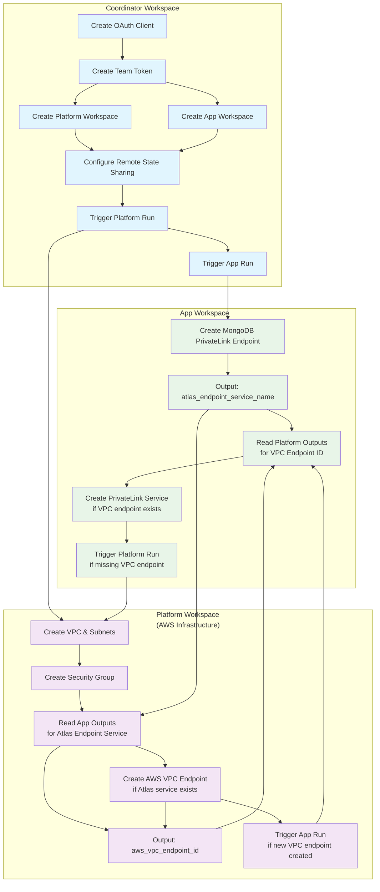

# TFE Workspace Orchestration Example

This example demonstrates a sophisticated **circular dependency resolution pattern** using Terraform Cloud/Enterprise (TFE) workspaces. It shows how to orchestrate multiple workspaces that depend on each other's outputs through conditional logic and cross-workspace run triggers.

## Use Case

This pattern solves the classic chicken-and-egg problem when setting up **MongoDB Atlas PrivateLink with AWS VPC Endpoints**:
- Atlas needs to know the AWS VPC Endpoint ID to complete the PrivateLink service
- AWS needs to know the Atlas endpoint service name to create the VPC Endpoint
- Both resources must exist for the connection to work

## Architecture Overview



## Components

### 1. Coordinator Workspace (`coordinator/`)
**Purpose**: Orchestrates the entire setup and manages workspace lifecycle

**Key Resources**:
- `tfe_oauth_client` - GitHub integration for VCS-driven workflows
- `tfe_team_token` - Authentication token for cross-workspace communication
- `tfe_workspace` (via module) - Creates Platform and App workspaces
- `tfe_workspace_settings` - Configures remote state sharing
- `tfe_workspace_run` - Triggers initial runs in both workspaces

**Configuration**:
- Sets up VCS integration with GitHub
- Injects variables and credentials into child workspaces
- Configures remote state consumer permissions
- Manages the initial deployment sequence

### 2. Platform Workspace (`platform/`)
**Purpose**: Manages AWS networking infrastructure

**Resources Created**:
- AWS VPC with private subnets and security groups
- AWS VPC Endpoint (conditionally created when Atlas service is available)

**Conditional Logic**:
```hcl
# Only create VPC endpoint if Atlas service exists
resource "aws_vpc_endpoint" "aws_endpoint" {
  count = local.atlas_endpoint_service_name != "" ? 1 : 0
  service_name = local.atlas_endpoint_service_name
}

# Trigger App run when new VPC endpoint is created
resource "tfe_workspace_run" "app_run" {
  count = local.trigger_app_run ? 1 : 0
  depends_on = [aws_vpc_endpoint.aws_endpoint]
}
```

### 3. App Workspace (`app/`)
**Purpose**: Manages MongoDB Atlas PrivateLink setup

**Resources Created**:
- MongoDB PrivateLink Endpoint (always created first)
- PrivateLink Service (conditionally created when AWS VPC endpoint exists)

**Conditional Logic**:
```hcl
# Always create Atlas endpoint first
resource "mongodbatlas_privatelink_endpoint" "mongodb_endpoint" {
  project_id    = var.atlas_project_id
  provider_name = "AWS"
  region        = var.aws_region
}

# Only create service if VPC endpoint exists
resource "mongodbatlas_privatelink_endpoint_service" "private_endpoint" {
  count = local.vpc_endpoint_id != "" ? 1 : 0
  endpoint_service_id = local.vpc_endpoint_id
}

# Trigger Platform run if VPC endpoint is missing
resource "tfe_workspace_run" "platform_run" {
  count = local.missing_vpc_endpoint ? 1 : 0
  depends_on = [mongodbatlas_privatelink_endpoint_service.private_endpoint]
}
```

## Execution Flow

### Phase 1: Initial Setup (Coordinator)
1. **Setup**: Coordinator creates OAuth client and team token
2. **Workspace Creation**: Creates Platform and App workspaces with VCS integration
3. **State Sharing**: Configures remote state consumer permissions
4. **Sequential Triggers**: Triggers Platform run first, then App run

### Phase 2: Circular Dependency Resolution
1. **App Run 1**: Creates Atlas PrivateLink endpoint → outputs `atlas_endpoint_service_name`
2. **Platform Run 2**: Reads Atlas service name → creates AWS VPC endpoint → outputs `aws_vpc_endpoint_id` → triggers App run
3. **App Run 2**: Reads VPC endpoint ID → creates PrivateLink service (completes the connection)

## Key Design Patterns

### 1. Conditional Resource Creation
Resources are only created when their dependencies are available:
```hcl
# Platform side
locals {
  atlas_endpoint_service_name = try(data.tfe_outputs.app[0].values.atlas_endpoint_service_name, "")
  create_aws_vpc_endpoint     = local.atlas_endpoint_service_name != "" && var.app_workspace != ""
}

# App side  
locals {
  vpc_endpoint_id      = try(data.tfe_outputs.platform[0].values.aws_vpc_endpoint_id, "")
  missing_vpc_endpoint = local.vpc_endpoint_id == ""
}
```

### 2. Cross-Workspace Communication
Workspaces share data through remote state and trigger each other's runs:
```hcl
# Reading remote state
data "tfe_outputs" "platform" {
  organization = var.tfe_org
  workspace    = var.platform_workspace
}

# Triggering cross-workspace runs
resource "tfe_workspace_run" "app_run" {
  workspace_id = data.tfe_workspace.app[0].id
  apply {
    manual_confirm = true
    wait_for_run   = false
  }
}
```

### 3. Remote State Consumer Configuration
```hcl
resource "tfe_workspace_settings" "this" {
  workspace_id              = each.value.workspace_id
  remote_state_consumer_ids = each.value.remote_state_consumer_ids
}
```

## Prerequisites

1. **Terraform Cloud/Enterprise Account** with appropriate permissions
2. **GitHub Repository** with the workspace configurations
3. **AWS Credentials** with VPC and endpoint management permissions
4. **MongoDB Atlas Credentials** with project and PrivateLink permissions
5. **TFE Team Token** with workspace management permissions

## Usage

### 1. Configure Variables
Create a `terraform.tfvars` file in the coordinator directory:

```hcl
tfe_organization = "your-tfe-org"
tfe_team_name    = "your-team"
GH_TOKEN         = "your-github-token"

platform_variables = {
  vpc_cidr = "10.0.0.0/16"
  vpc_name = "atlas-vpc"
}

app_variables = {
  atlas_project_id = "your-atlas-project-id"
}

aws_credentials = {
  AWS_ACCESS_KEY_ID     = "your-aws-key"
  AWS_SECRET_ACCESS_KEY = "your-aws-secret"
}

atlas_credentials = {
  MONGODB_ATLAS_PUBLIC_KEY  = "your-atlas-public-key"
  MONGODB_ATLAS_PRIVATE_KEY = "your-atlas-private-key"
}
```

### 2. Deploy from Coordinator
```bash
cd coordinator/
terraform init
terraform plan
terraform apply
```

### 3. Monitor Execution
The coordinator will:
- Create both workspaces
- Trigger the Platform workspace run
- Wait for Platform completion
- Trigger the App workspace run
- The App and Platform workspaces will then trigger each other as needed

**Expected Timeline** (based on logs):
- Platform workspace: ~1-2 minutes
- App workspace initial run: ~3 minutes
- Cross-workspace triggers: Additional 1-2 minutes each

## Benefits

1. **Resolves Circular Dependencies**: Enables resources that depend on each other across different teams/workspaces
2. **Separation of Concerns**: Platform team manages AWS, App team manages Atlas
3. **Automated Orchestration**: No manual intervention after initial deployment
4. **State Isolation**: Each team maintains their own Terraform state
5. **Conditional Execution**: Resources created only when dependencies are ready
6. **Scalable Pattern**: Can be extended to more complex multi-workspace scenarios

## Limitations

1. **Manual Confirmation**: Cross-workspace runs require manual confirmation by default
2. **Workspace Names**: Currently hardcoded for simplicity
3. **Single Region**: Example configured for single AWS region deployment
4. **Error Handling**: Limited error recovery if intermediate runs fail

## Alternative Approach: Coordinator-Orchestrated Variables

While the current implementation uses cross-workspace remote state sharing and autonomous triggers, an alternative approach would give more control to the coordinator workspace by managing variables directly.

### Current vs Alternative Approach

| Aspect | Current (Autonomous) | Alternative (Coordinator-Managed) |
|--------|---------------------|-----------------------------------|
| **Responsibility** | Workspaces trigger each other | Coordinator orchestrates everything |
| **Data Sharing** | Remote state outputs | Variables injected by coordinator |
| **Run Triggers** | Cross-workspace `tfe_workspace_run` | Coordinator-managed runs only |
| **Complexity** | Distributed logic | Centralized orchestration |
| **Autonomy** | High workspace independence | Coordinator controls flow |

### Alternative Implementation

In this approach, the coordinator would:

1. **Run Platform First** - Create AWS VPC and basic infrastructure
2. **Extract Platform Outputs** - Read platform state to get VPC details
3. **Run App with VPC Info** - Inject VPC variables into app workspace
4. **Extract App Outputs** - Read app state to get Atlas endpoint service
5. **Update Platform Variables** - Inject Atlas service name back to platform
6. **Re-run Platform** - Create VPC endpoint with Atlas service info
7. **Update App Variables** - Inject VPC endpoint ID back to app
8. **Re-run App** - Complete PrivateLink service creation

### Coordinator Implementation Example

```hcl
# coordinator/main.tf - Alternative approach

# Step 1: Initial Platform Run
resource "tfe_workspace_run" "platform_initial" {
  workspace_id = module.platform_workspace.workspace_id
  apply {
    manual_confirm = false
    wait_for_run   = true
  }
}

# Step 2: Read Platform Outputs
data "tfe_outputs" "platform_initial" {
  organization = var.tfe_organization
  workspace    = var.tfe_workspace_names.platform
  depends_on   = [tfe_workspace_run.platform_initial]
}

# Step 3: Run App with Platform Variables
resource "tfe_variable" "app_vpc_info" {
  key          = "vpc_id"
  value        = data.tfe_outputs.platform_initial.values.vpc_id
  category     = "terraform"
  workspace_id = module.app_workspace.workspace_id
  depends_on   = [tfe_workspace_run.platform_initial]
}

resource "tfe_workspace_run" "app_initial" {
  workspace_id = module.app_workspace.workspace_id
  apply {
    manual_confirm = false
    wait_for_run   = true
  }
  depends_on = [tfe_variable.app_vpc_info]
}

# Step 4: Read App Outputs
data "tfe_outputs" "app_initial" {
  organization = var.tfe_organization
  workspace    = var.tfe_workspace_names.app
  depends_on   = [tfe_workspace_run.app_initial]
}

# Step 5: Update Platform with Atlas Service Info
resource "tfe_variable" "platform_atlas_service" {
  key          = "atlas_endpoint_service_name"
  value        = data.tfe_outputs.app_initial.values.atlas_endpoint_service_name
  category     = "terraform"
  workspace_id = module.platform_workspace.workspace_id
  depends_on   = [tfe_workspace_run.app_initial]
}

# Step 6: Re-run Platform to Create VPC Endpoint
resource "tfe_workspace_run" "platform_final" {
  workspace_id = module.platform_workspace.workspace_id
  apply {
    manual_confirm = false
    wait_for_run   = true
  }
  depends_on = [tfe_variable.platform_atlas_service]
}

# Step 7: Read Platform Final Outputs
data "tfe_outputs" "platform_final" {
  organization = var.tfe_organization
  workspace    = var.tfe_workspace_names.platform
  depends_on   = [tfe_workspace_run.platform_final]
}

# Step 8: Update App with VPC Endpoint Info
resource "tfe_variable" "app_vpc_endpoint" {
  key          = "vpc_endpoint_id"
  value        = data.tfe_outputs.platform_final.values.aws_vpc_endpoint_id
  category     = "terraform"
  workspace_id = module.app_workspace.workspace_id
  depends_on   = [tfe_workspace_run.platform_final]
}

# Step 9: Final App Run to Complete PrivateLink
resource "tfe_workspace_run" "app_final" {
  workspace_id = module.app_workspace.workspace_id
  apply {
    manual_confirm = false
    wait_for_run   = true
  }
  depends_on = [tfe_variable.app_vpc_endpoint]
}
```

### Simplified Workspace Logic

With this approach, the platform and app workspaces become much simpler:

**Platform Workspace** (`platform/main.tf`):
```hcl
# No cross-workspace data sources needed
# No tfe_workspace_run resources needed

variable "atlas_endpoint_service_name" {
  type        = string
  default     = ""
  description = "Injected by coordinator"
}

resource "aws_vpc_endpoint" "aws_endpoint" {
  count = var.atlas_endpoint_service_name != "" ? 1 : 0
  # ... rest of configuration
  service_name = var.atlas_endpoint_service_name
}
```

**App Workspace** (`app/main.tf`):
```hcl
# No cross-workspace data sources needed
# No tfe_workspace_run resources needed

variable "vpc_endpoint_id" {
  type        = string
  default     = ""
  description = "Injected by coordinator"
}

resource "mongodbatlas_privatelink_endpoint_service" "private_endpoint" {
  count = var.vpc_endpoint_id != "" ? 1 : 0
  # ... rest of configuration
  endpoint_service_id = var.vpc_endpoint_id
}
```

### Benefits of Alternative Approach

1. **Centralized Control**: All orchestration logic in one place
2. **Simpler Workspaces**: Platform and app workspaces focus only on their resources
3. **Explicit Dependencies**: Clear execution order defined in coordinator
4. **Easier Debugging**: Single point to troubleshoot workflow issues
5. **No Cross-Workspace Permissions**: No need for remote state consumer setup
6. **Linear Execution**: Predictable step-by-step execution

### Drawbacks of Alternative Approach

1. **Coordinator Complexity**: More complex coordinator with multiple runs and data sources
2. **Tight Coupling**: Workspaces become more dependent on coordinator structure
3. **Longer Execution**: More sequential runs vs parallel potential
4. **Variable Management**: Need to manage variable lifecycle and cleanup
5. **Less Autonomy**: Teams have less independence in their workspace logic

### When to Use Each Approach

**Current Approach (Autonomous)** is better for:
- Teams that need high autonomy
- Complex scenarios with multiple interdependencies
- When workspaces should be self-sufficient
- Advanced Terraform teams comfortable with conditional logic

**Alternative Approach (Coordinator-Managed)** is better for:
- Centralized DevOps teams managing everything
- Simpler workspace requirements
- When predictable execution order is critical
- Teams newer to Terraform looking for explicit workflows

Both approaches solve the same fundamental problem but with different trade-offs in complexity, control, and team autonomy.

## Implementation Gotchas

### 1. Team Token Required for Cross-Workspace Runs

**Issue**: The `tfe_workspace_run` resource requires proper authentication to trigger runs in other workspaces.

**Error you'll see**:
```
Error: error creating run for workspace ws-PAC96vFddwdgTyjt: resource not found
```

**Solution**: Create a `tfe_team_token` with appropriate permissions as shown in the coordinator configuration:

```hcl
# coordinator/main.tf
data "tfe_team" "this" {
  name         = var.tfe_team_name
  organization = var.tfe_organization
}

resource "tfe_team_token" "this" {
  team_id     = data.tfe_team.this.id
  description = "token used to allow triggering runs in sibling workspaces"
  expired_at  = time_rotating.this.rotation_rfc3339
}

# Inject token into workspaces as sensitive variable
locals {
  shared_sensitive_variables = {
    tfe_token = tfe_team_token.this.token
  }
}
```

**Required Team Permissions**:
- Read access to workspace state (for `data.tfe_outputs`)
- Manage runs permission (for `tfe_workspace_run`)
- Variable management (if using coordinator-managed approach)

### 2. Static Workspace Names in Cloud Backend

**Issue**: The `terraform.cloud.workspaces.name` configuration in child workspaces is static and cannot use variables or environment variables like `TF_WORKSPACE`.

**Current limitation**:
```hcl
# This DOESN'T work in platform/app workspaces
terraform {
  cloud {
    organization = var.tfe_org  # ❌ Cannot use variables
    workspaces {
      name = var.workspace_name  # ❌ Cannot use variables
    }
  }
}
```

**Required static configuration**:
```hcl
# platform/versions.tf - Must be hardcoded
terraform {
  cloud {
    organization = "your-org-name"  # ✅ Must be static
    workspaces {
      name = "vcs-platform"         # ✅ Must be static
    }
  }
}
```

**Workaround for Production Use**:

In real-world scenarios, this limitation is often not problematic because:

1. **Module-based approach**: Platform and app workspaces typically call modules rather than containing all logic:
   ```hcl
   # platform/main.tf (simple)
   module "aws_infrastructure" {
     source = "../../modules/aws-platform"
     # ... variables
   }
   ```

2. **Template generation**: Use tools like `cookiecutter` or `terragrunt` to generate workspace configurations

3. **Workspace-per-environment**: Create separate workspace configurations for each environment:
   ```
   workspaces/
   ├── dev-platform/     # name = "dev-platform"
   ├── staging-platform/ # name = "staging-platform"
   └── prod-platform/    # name = "prod-platform"
   ```

### 3. Remote State Consumer Permissions

**Issue**: Cross-workspace data access requires explicit permission configuration.

**Error you might see**:
```
Error: Error reading outputs from workspace: workspace access denied
```

**Solution**: Configure remote state consumers in the coordinator:
```hcl
resource "tfe_workspace_settings" "this" {
  for_each = {
    platform = {
      workspace_id              = module.app_workspace.workspace_id
      remote_state_consumer_ids = [module.platform_workspace.workspace_id]
    }
    app = {
      workspace_id              = module.platform_workspace.workspace_id
      remote_state_consumer_ids = [module.app_workspace.workspace_id]
    }
  }
  workspace_id              = each.value.workspace_id
  remote_state_consumer_ids = each.value.remote_state_consumer_ids
}
```

### 4. Manual Confirmation in Cross-Workspace Runs

**Issue**: By default, cross-workspace triggered runs require manual confirmation, which defeats the automation purpose.

**Configuration**:
```hcl
# In platform/app workspaces
resource "tfe_workspace_run" "app_run" {
  workspace_id = data.tfe_workspace.app[0].id

  apply {
    manual_confirm = true   # ❌ Requires manual intervention
    wait_for_run   = false  # ❌ Doesn't wait for completion
  }
}

# Better for automation
resource "tfe_workspace_run" "app_run" {
  workspace_id = data.tfe_workspace.app[0].id

  apply {
    manual_confirm = false  # ✅ Automatic confirmation
    wait_for_run   = true   # ✅ Waits for completion
  }
}
```

**Security Consideration**: Setting `manual_confirm = false` means runs will auto-apply. Ensure your team is comfortable with this level of automation.

### 5. Workspace Run Polling and Timeouts

**Issue**: The TFE provider polls for run completion, which can timeout on long-running deployments.

**Symptoms**:
- Runs shown as "Still creating..." for extended periods
- Terraform operations timing out while workspace runs are still active

**Monitoring**: Watch for these log patterns:
```
tfe_workspace_run.app_run: Still creating... [02m58s elapsed]
[INFO] Waiting for run run-p2WpmMJsCj7drMm2, status is applying
[INFO] Run run-p2WpmMJsCj7drMm2 has reached a terminal state: applied
```

**Best Practices**:
- Use `wait_for_run = true` for sequential dependencies
- Consider timeout settings for very long deployments
- Monitor TFE UI for run status if Terraform times out

## Related Resources

- [Terraform Cloud Workspaces](https://developer.hashicorp.com/terraform/cloud-docs/workspaces)
- [TFE Provider Documentation](https://registry.terraform.io/providers/hashicorp/tfe/latest/docs)
- [MongoDB Atlas PrivateLink](https://www.mongodb.com/docs/atlas/security-private-endpoint/)
- [AWS VPC Endpoints](https://docs.aws.amazon.com/vpc/latest/privatelink/vpc-endpoints.html)
