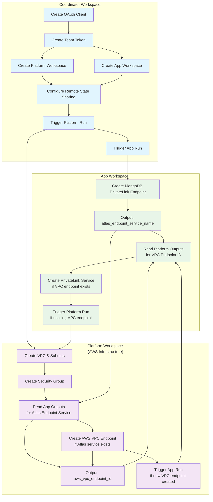

# TFE Workspace Orchestration Example

This example demonstrates a sophisticated **circular dependency resolution pattern** using Terraform Cloud/Enterprise (TFE) workspaces. It shows how to orchestrate multiple workspaces that depend on each other's outputs through conditional logic and cross-workspace run triggers.

## Use Case

This pattern solves the classic chicken-and-egg problem when setting up **MongoDB Atlas PrivateLink with AWS VPC Endpoints**:
- Atlas needs to know the AWS VPC Endpoint ID to complete the PrivateLink service
- AWS needs to know the Atlas endpoint service name to create the VPC Endpoint
- Both resources must exist for the connection to work

## Architecture Overview



## Components

### 1. Coordinator Workspace (`coordinator/`)
**Purpose**: Orchestrates the entire setup and manages workspace lifecycle

**Key Resources**:
- `tfe_oauth_client` - GitHub integration for VCS-driven workflows
- `tfe_team_token` - Authentication token for cross-workspace communication
- `tfe_workspace` (via module) - Creates Platform and App workspaces
- `tfe_workspace_settings` - Configures remote state sharing
- `tfe_workspace_run` - Triggers initial runs in both workspaces

**Configuration**:
- Sets up VCS integration with GitHub
- Injects variables and credentials into child workspaces
- Configures remote state consumer permissions
- Manages the initial deployment sequence

### 2. Platform Workspace (`platform/`)
**Purpose**: Manages AWS networking infrastructure

**Resources Created**:
- AWS VPC with private subnets and security groups
- AWS VPC Endpoint (conditionally created when Atlas service is available)

**Conditional Logic**:
```hcl
# Only create VPC endpoint if Atlas service exists
resource "aws_vpc_endpoint" "aws_endpoint" {
  count = local.atlas_endpoint_service_name != "" ? 1 : 0
  service_name = local.atlas_endpoint_service_name
}

# Trigger App run when new VPC endpoint is created
resource "tfe_workspace_run" "app_run" {
  count = local.trigger_app_run ? 1 : 0
  depends_on = [aws_vpc_endpoint.aws_endpoint]
}
```

### 3. App Workspace (`app/`)
**Purpose**: Manages MongoDB Atlas PrivateLink setup

**Resources Created**:
- MongoDB PrivateLink Endpoint (always created first)
- PrivateLink Service (conditionally created when AWS VPC endpoint exists)

**Conditional Logic**:
```hcl
# Always create Atlas endpoint first
resource "mongodbatlas_privatelink_endpoint" "mongodb_endpoint" {
  project_id    = var.atlas_project_id
  provider_name = "AWS"
  region        = var.aws_region
}

# Only create service if VPC endpoint exists
resource "mongodbatlas_privatelink_endpoint_service" "private_endpoint" {
  count = local.vpc_endpoint_id != "" ? 1 : 0
  endpoint_service_id = local.vpc_endpoint_id
}

# Trigger Platform run if VPC endpoint is missing
resource "tfe_workspace_run" "platform_run" {
  count = local.missing_vpc_endpoint ? 1 : 0
  depends_on = [mongodbatlas_privatelink_endpoint_service.private_endpoint]
}
```

## Execution Flow

### Phase 1: Initial Setup (Coordinator)
1. **Setup**: Coordinator creates OAuth client and team token
2. **Workspace Creation**: Creates Platform and App workspaces with VCS integration
3. **State Sharing**: Configures remote state consumer permissions
4. **Sequential Triggers**: Triggers Platform run first, then App run

### Phase 2: Circular Dependency Resolution
1. **App Run 1**: Creates Atlas PrivateLink endpoint → outputs `atlas_endpoint_service_name`
2. **Platform Run 2**: Reads Atlas service name → creates AWS VPC endpoint → outputs `aws_vpc_endpoint_id` → triggers App run
3. **App Run 2**: Reads VPC endpoint ID → creates PrivateLink service (completes the connection)

## Key Design Patterns

### 1. Conditional Resource Creation
Resources are only created when their dependencies are available:
```hcl
# Platform side
locals {
  atlas_endpoint_service_name = try(data.tfe_outputs.app[0].values.atlas_endpoint_service_name, "")
  create_aws_vpc_endpoint     = local.atlas_endpoint_service_name != "" && var.app_workspace != ""
}

# App side  
locals {
  vpc_endpoint_id      = try(data.tfe_outputs.platform[0].values.aws_vpc_endpoint_id, "")
  missing_vpc_endpoint = local.vpc_endpoint_id == ""
}
```

### 2. Cross-Workspace Communication
Workspaces share data through remote state and trigger each other's runs:
```hcl
# Reading remote state
data "tfe_outputs" "platform" {
  organization = var.tfe_org
  workspace    = var.platform_workspace
}

# Triggering cross-workspace runs
resource "tfe_workspace_run" "app_run" {
  workspace_id = data.tfe_workspace.app[0].id
  apply {
    manual_confirm = true
    wait_for_run   = false
  }
}
```

### 3. Remote State Consumer Configuration
```hcl
resource "tfe_workspace_settings" "this" {
  workspace_id              = each.value.workspace_id
  remote_state_consumer_ids = each.value.remote_state_consumer_ids
}
```

## Prerequisites

1. **Terraform Cloud/Enterprise Account** with appropriate permissions
2. **GitHub Repository** with the workspace configurations
3. **AWS Credentials** with VPC and endpoint management permissions
4. **MongoDB Atlas Credentials** with project and PrivateLink permissions
5. **TFE Team Token** with workspace management permissions

## Usage

### 1. Configure Variables
Create a `terraform.tfvars` file in the coordinator directory:

```hcl
tfe_organization = "your-tfe-org"
tfe_team_name    = "your-team"
GH_TOKEN         = "your-github-token"

platform_variables = {
  vpc_cidr = "10.0.0.0/16"
  vpc_name = "atlas-vpc"
}

app_variables = {
  atlas_project_id = "your-atlas-project-id"
}

aws_credentials = {
  AWS_ACCESS_KEY_ID     = "your-aws-key"
  AWS_SECRET_ACCESS_KEY = "your-aws-secret"
}

atlas_credentials = {
  MONGODB_ATLAS_PUBLIC_KEY  = "your-atlas-public-key"
  MONGODB_ATLAS_PRIVATE_KEY = "your-atlas-private-key"
}
```

### 2. Deploy from Coordinator
```bash
cd coordinator/
terraform init
terraform plan
terraform apply
```

### 3. Monitor Execution
The coordinator will:
- Create both workspaces
- Trigger the Platform workspace run
- Wait for Platform completion
- Trigger the App workspace run
- The App and Platform workspaces will then trigger each other as needed

**Expected Timeline** (based on logs):
- Platform workspace: ~1-2 minutes
- App workspace initial run: ~3 minutes
- Cross-workspace triggers: Additional 1-2 minutes each

## Benefits

1. **Resolves Circular Dependencies**: Enables resources that depend on each other across different teams/workspaces
2. **Separation of Concerns**: Platform team manages AWS, App team manages Atlas
3. **Automated Orchestration**: No manual intervention after initial deployment
4. **State Isolation**: Each team maintains their own Terraform state
5. **Conditional Execution**: Resources created only when dependencies are ready
6. **Scalable Pattern**: Can be extended to more complex multi-workspace scenarios

## Limitations

1. **Manual Confirmation**: Cross-workspace runs require manual confirmation by default
2. **Workspace Names**: Currently hardcoded for simplicity
3. **Single Region**: Example configured for single AWS region deployment
4. **Error Handling**: Limited error recovery if intermediate runs fail


## Related Resources

- [Terraform Cloud Workspaces](https://developer.hashicorp.com/terraform/cloud-docs/workspaces)
- [TFE Provider Documentation](https://registry.terraform.io/providers/hashicorp/tfe/latest/docs)
- [MongoDB Atlas PrivateLink](https://www.mongodb.com/docs/atlas/security-private-endpoint/)
- [AWS VPC Endpoints](https://docs.aws.amazon.com/vpc/latest/privatelink/vpc-endpoints.html)
